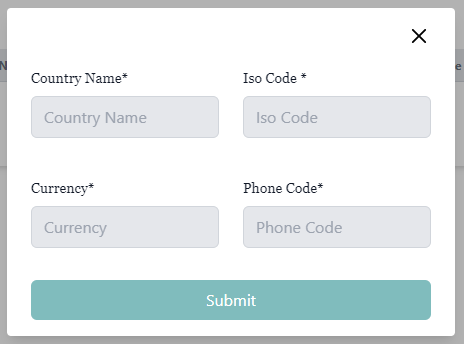
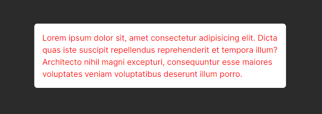

### Custom Modal 1 basic 
<p align="center">
  
</p>

```js
  const [isopen,setisOpen]=useState(false)
      function clickopen(){
        setisOpen(!isopen)
      }
      function onClosee(){
        setisOpen(!isopen)
      }

   <button onClick={()=>clickopen()} className='bg-[red] text-white py-2 px-4'>Click</button>
    <Modal isOpen={isopen} title={"Ceate fjlfj"} onClose={onClosee}></Modal>
```
```js
import { RxCross2 } from "react-icons/rx";
const Modal = ({ isOpen, onClose, title, children }) => {
    return (
      <div className={`fixed inset-0 z-50 overflow-auto flex justify-center items-center ${isOpen ? 'opacity-100 pointer-events-auto' : 'opacity-0 pointer-events-none transition-all duration-100'}`}>
        <div className="fixed inset-0 z-50 overflow-auto flex justify-center items-center">
          <div className="modal-overlay absolute w-full h-full bg-black opacity-30"></div>
          <div className="bg-white w-11/12 md:max-w-md mx-auto rounded shadow-lg z-50 overflow-y-auto">
            <div className="py-4 text-left px-6">
              <div className="flex justify-between items-center pb-3">
                <p className="text-2xl font-bold">{title}</p>
                <button className="modal-close" onClick={onClose}>
                 <RxCross2 className="w-6 h-6" />
                </button>
              </div>
              <div className="modal-body">{children}</div>
            </div>
          </div>
        </div>
      </div>
    );
  };

  export default Modal;
```

### custom Modal not button use (Next js)

<p align="center">
  
</p>

```js
"use client";
import { useRouter } from "next/navigation";
import { useCallback, useEffect, useRef } from "react";

export default function Modal({ children }) {
    const overlay = useRef(null);
    const wrapper = useRef(null);
    const router = useRouter();

    const onDismiss = useCallback(() => {
        router.back();
    }, [router]);

    const onClick = useCallback(
        (e) => {
            if (e.target === overlay.current || e.target === wrapper.current) {
                if (onDismiss) onDismiss();
            }
        },
        [onDismiss, overlay, wrapper]
    );

    const onKeyDown = useCallback(
        (e) => {
            if (e.key === "Escape") onDismiss();
        },
        [onDismiss]
    );

    useEffect(() => {
        document.addEventListener("keydown", onKeyDown);
        return () => document.removeEventListener("keydown", onKeyDown);
    }, [onKeyDown]);


    return (
        <div
            ref={overlay}
            className="fixed z-10 left-0 right-0 top-0 bottom-0 mx-auto bg-[#000000d4]  p-10"
            onClick={onClick}
        >
            <div
                ref={wrapper}
                className="absolute top-1/2 left-1/2 -translate-x-1/2 -translate-y-1/2 sm:w-10/12 md:w-8/12 lg:w-2/5 p-6"
            >
               <div className="bg-[white] text-[red] p-4 !opacity-100 rounded-md">
                 <p>Lorem ipsum dolor sit, amet consectetur adipisicing elit. Dicta quas iste suscipit repellendus reprehenderit et tempora illum? Architecto nihil magni excepturi, 
                 consequuntur esse maiores voluptates veniam voluptatibus deserunt illum porro.</p>
                    {children}
               </div>
            </div>
        </div>
    );
}

```

```js
// css style
dialog::backdrop {
  background: rgba(0, 0, 0, 0.55);
}


"use client";
import { useRouter } from "next/navigation";
import { createPortal } from "react-dom";
import { useEffect, useRef } from "react";

import Image from "next/image";

const Modal = ({ children }) => {
  const modalRef = useRef(null);
  const router = useRouter();

  useEffect(() => {
    if (!modalRef.current?.open) {
      modalRef.current?.showModal();
    }
  }, []);

  function onHide() {
    router.back();
  }

  return createPortal(
      <dialog
        ref={modalRef}
        onClose={onHide}
        className="shadow-teal-700 shadow-md border border-teal-600 flex flex-col p-2 rounded-md dark:bg-black dark:bg-opacity-95 dark:text-gray-100"
      >
        <span onClick={onHide}
          className="flex justify-end cursor-pointer">
            <Image
              src="/xmark.svg"
              alt="close"
              width={30}
              height={30} />
          </span>
          {children}
      </dialog>
    ,
    document.getElementById("modal-root-content")
  );
};

export default Modal;

```

```js

// import { FaWindowClose } from "react-icons/fa";


// const Modal = ({ isOpen, onClose, title, children }) => {
//     return (
//       <div className={`modal ${isOpen ? 'opacity-100 pointer-events-auto  !z-[9999999]' : 'opacity-0 pointer-events-none transition-all duration-100'}`}>
//         <div className="modal">
//           <div className="modal-overlay absolute w-full h-full bg-black opacity-60"></div>
//           <div className="modal-container">
//             <div className="modal-content">
//               <div className="modal-box h-20 w-full bg-gray-600 ">
//                 <p className="text-2xl font-bold">{title}</p>
//                 <button className="modal-close" onClick={onClose}>
//                  <FaWindowClose  className="w-6 h-6" />
//                 </button>
//               </div>
//               <div className="modal-body p-2 bg-gray-500">{children}</div>
//             </div>
//           </div>
//         </div>
//       </div>
//     );
//   };

//   export default Modal;

"use client"
import { createPortal } from "react-dom";
import {useEffect, useRef } from "react";
import { IoClose } from "react-icons/io5";
import "./index.css"

const Modal = ({ children,isOpen,title}) => {
  const modalRef = useRef(null);


  // const handleOpen = () => {
  //   const modal = modalRef.current;
  //   if (modal) {
  //     modal.showModal();
  //   }
  // };
  useEffect(()=>{
    const modal = modalRef.current;
    if (modal) {
      modal.showModal();
      document.body.classList.add('overflow-hidden')
    }
  },[])


  const handleClose = () => {
    const modal = modalRef.current;
    if (modal) {
      document.body.classList.remove('overflow-hidden')
      modal.close();
    }
  };


  return createPortal(
    <dialog
      ref={modalRef}
      className="shadow-teal-700 shadow-md w-[800px] border-2 border-teal-600 outline-none flex flex-col p-6 rounded-xl bg-[#09090B]"
    >
      <div className="flex justify-between mb-5 text-white">
        <h1>{title}</h1>
        <h1 onClick={handleClose}>X</h1>
      </div>
      <div className="text-[#74747B]">
      {children}
      </div>
    </dialog>,
    document.body
  );
};

export default Modal;


```
