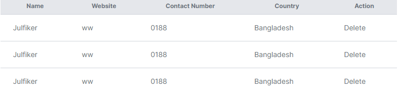

### CustomTable Components
<p align="center">
  
</p>

```js

.custom-table tr {
    @apply whitespace-nowrap;
}

.custom-table tr td {
    @apply px-6 py-4 text-sm  text-gray-500;
}
````
```js
import './CustomTable.css'
export default function CustomTable({ headers, children }) {
    return (
      <div>
        <div className="overflow-x-auto">
          <table className="divide-y divide-gray-300 w-full">
            <thead className="bg-gray-200">
              <tr>
                {headers.map((header, index) => (
                  <th className="px-6 py-2 text-xs text-gray-500" key={index}>{header}</th>
                ))}
              </tr>
            </thead>
            <tbody className="bg-white divide-y divide-gray-300 custom-table">
                {children}
            </tbody>
          </table>
        </div>
      </div>
    );
  }
  
````


