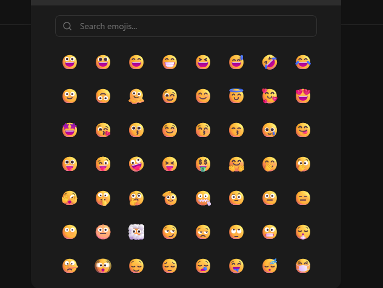

```sh
https://emoji-api.com/
```




```js
import { NoItemData } from "@/components/reuseble/table-no-item";
import { Input, ScrollArea, Button } from "@/components/ui";
import { Loader, Search } from "lucide-react";
import React, { useState, useEffect, useCallback } from "react";


// Define the type for the emoji data 
type Emoji = { character: string };

export default function EmojiBox() {
  const [searchQuery, setSearchQuery] = useState("");
  const [emojis, setEmojis] = useState<Emoji[]>([]); // Use the defined type
  const [loading, setLoading] = useState(false);

  const API_KEY = "7";

  const fetchEmojis = useCallback(async () => {
    setLoading(true);
    const url = `https://emoji-api.com/emojis?access_key=${API_KEY}&search=${encodeURIComponent(
      searchQuery
    )}`;

    try {
      const response = await fetch(url);
      if (!response.ok) throw new Error("Failed to fetch emojis");

      const data: Emoji[] = await response.json();
      setEmojis(data);
    } catch (error) {
      console.error("Error fetching emojis:", error);
    } finally {
      setLoading(false);
    }
  }, [searchQuery, API_KEY]);

  useEffect(() => {
    fetchEmojis();
  }, [searchQuery, fetchEmojis]);

  return (
    <div>
      <div className="px-6 pb-4">
        <div className="relative">
          <Search className="absolute left-3 top-1/2 transform -translate-y-1/2 text-muted-foreground h-4 w-4" />
          <Input
            placeholder="Search emojis..."
            value={searchQuery}
            onChange={(e) => setSearchQuery(e.target.value)}
            className="pl-10"
          />
        </div>
      </div>

      <ScrollArea className="h-96 px-6">
        {loading ? (
          <div className="flex flex-col items-center justify-center py-8">
            <Loader className="size-10 animate-spin text-figma-primary" />
            <h1 className="ml-2 text-secondery-figma text-lg">
              Loading Emojis...
            </h1>
          </div>
        ) : emojis.length ? (
          <div className="grid grid-cols-8 gap-2">
            {emojis.map((emoji, index) => (
              <Button
                key={index}
                variant="ghost"
                className="h-12 w-12 text-2xl cursor-pointer p-0 hover:border hover:bg-transparent"
                onClick={() => console.log(emoji)} // Handle emoji click
              >
                {emoji.character}
              </Button>
            ))}
          </div>
        ) : (
          <NoItemData title="No emojis found" />
        )}
      </ScrollArea>
    </div>
  );
}


```