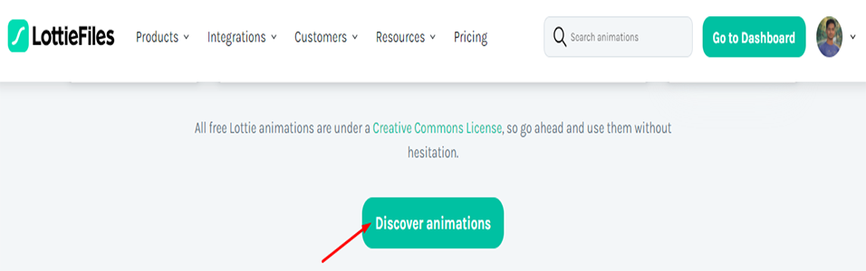
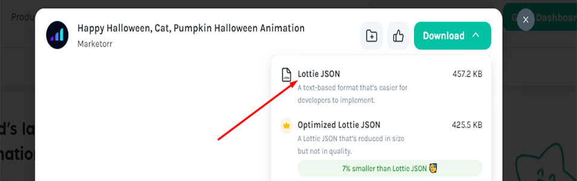

<p>
 <h1 style="color:red;" align="center">LottieFiles+lottie-react->Image Animation</h1>
</p>




```sh
npm i lottie-react
```

  ```js
import React from 'react';
import Lottie from "lottie-react";
import animationlo from './animation_lobqv121.json'

const Service = () => {
    return (
        <div className='w-11/12 lg:max-w-7xl m-auto py-5'>
            <Lottie animationData={animationlo} loop={true} />
        </div>
    );
};

export default Service;
  ```